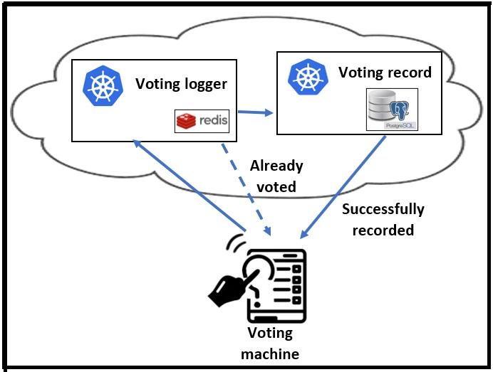
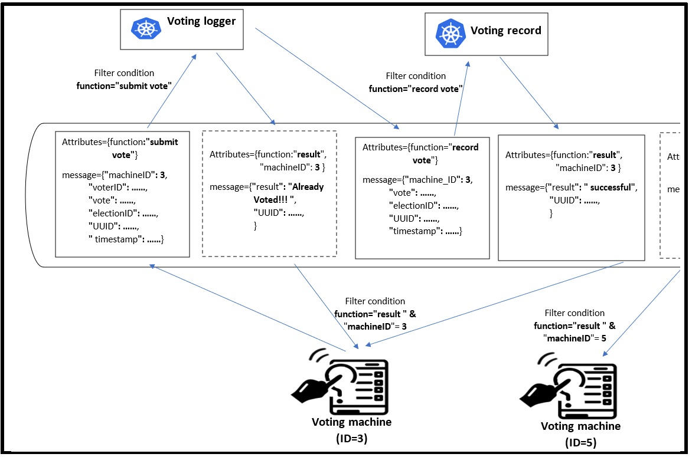

# Milestone 4: Google Pub/Sub communication for Microservices
## Objective:
* Get familiar with microservices.
* Implement microservice using Python.
* Containerize Python application.
* Configure Pub/Sub Subscription(s) to filter the receiving messages.

## Repository:
[https://github.com/GeorgeDaoud3/SOFE4630U-MS4](https://github.com/GeorgeDaoud3/SOFE4630U-MS4)

## Introduction 
1. See the following video for [the foundations of microservices](https://www.youtube.com/watch?v=lL_j7ilk7rc).
2. Read this document about [Event-driven architecture with Pub/Sub](https://cloud.google.com/solutions/event-driven-architecture-pubsub). Focus on the **event filter** technique, its advantages, limitations, and implementation. The microservices implemented in the milestone will use this technique to communicate.
3. The milestone would implement a cloud solution for a cloud-based election system. The following figure shows the architecture of the system

   
   
   It consists of:
   1. **A voting machine**
      * A Python script that will run on a local machine to simulate a real voting machine.]
      * First, it asks for the **election ID** and the **machine ID**.
      * Then, it generates random votes and sends them to a **voting logger** service.
      * Finally, it will wait for a response for 10 sec.
      * There will be three expected outputs: 
         1. **Already voted** if a vote with the same **voter ID** was processed before.
         2. **A vote was recorded successfully**.
         3. **Time out** if the vote processing takes much longer than expected (10 sec).
      * You can run multiple script instances but with different **machine ID**. 
   2. A **voting logger** service.
      * The service accesses a Redis server to store the IDs of the voters who have already been voted on.
      * When a vote is received,
         * Redis will be checked for the **voter ID**.
         * If the **voter ID** exists, an **Already voted** message will be sent to the voting machine.
         * Otherwise,
            * The **voter ID** will be stored in the Redis database to prevent the voter from repeating the vote.
            * After excluding the **voter ID** (for voter privacy policy), the voting information will be sent to the **voting record** service.
   3. A **voting record** service.
      * The service uses a **PostgreSQL** server to store the votes.
      * Once, a **voting record** is received, it will be stored in a the **PostgreSQL** server.
      * Then a **A vote was recorded successfully** will be sent to the **voting machine**.
   4. A **Google Pub/sub** for handling the communication between the microservices.
      * No IP or URL of the microservices is needed to exchange data. Only the **topic ID** is needed.
      * One topic will be used to exchange the data between the voting machine(s) and the two services.
      * A universally unique identifier (UUID) will be used to identify the vote during the processing by the services.
      * The message attributes will be set to filter the messages. Subscriptions will be created for the topic. Each will specify the condition of the received message (filter). Only messages with a matched filter conditions will be received by the Subscriber using the filtered subscription.
      * The attribute values set and filtered by each microservice as well as the message formats are shown in the following figure.

        
        
## settng up the GCP project
1. Create a new topic in Google Pub/Sub with a default subscription; name it **election**.
2. <div id="cred">Create a service account with the Google Pub/Sub admin rule. Create and download a JSON file with the corresponding credentials. ( **or use the one already created in MS2**)</div>
3. As each service will be containerized, a docker repository is needed to host the docker images of the **logger** and **recorder** services.
   1. Search for Artifact Registry
      
      
   2. In the **repositories** tab, press the + button to create a new repo.
    
      
   3. Name it **sofe4630u** and make sure that the type is set to **Docker**. Set the region to **northamerica-northeast2 (Toronto)**. Finally, press **create**.

      
   4. <div id="sofe4630u">open the **sofe4630u** repository and copy the repo path.</div>

      

      and save it in an environment variable
      ``` cmd
      REPO=<REPO full path>
      echo $REPO
      ```
## The logger service
### The python Code
This subsection will go through the Python script at [voting_logger/main.py](voting_logger/main.py). 
1. **Lines 11: 12** : search for a JSON file in the current directory and use it for GCP credentials. It assumes that only a single JSON file exists in the current directory.
2. **Lines 15: 18** : use the values of predefined environment variables to set the values of redis_host, project_id, subscription_id, and topic_name variables. To prevent having the values of the variables hard coded in the code.
   
   

3. **Lines 20: 22** : define a **debug** variable and initialize it by **False**. However, it can be changed to **True** in the code or by setting another environment variable, **DEBUG**. If it is set to **True**, logs and information will be printed for debugging reasons, as in lines 23:28.
   
   

4. **Lines 30: 44** : Repeatedly try to connect to the Redis server each second. The service will terminate if the connection can't be established in a minute. 

   
   
5. **Lines 79: 101**: create a subscription and use it to subscribe to the topic.
   1. **Line 80** : create a **subscription path** using the **project ID** and the **subscription ID**.
   2. **Line 81** : create a filter for the subscription (**function="submit vote"**).
   3. **Lines 89:90** : create a **subscription** for the **subscription path** using the filter.
   4. **Lines 88:93** : create a **subscription** if it does not exist. If it already exists, the creation will fail, an exception will be thrown which will be handled by the except block.
   5. **Lines 97:101** : subscribe to the topic using the **subscription** and set the callback function to handle the received messages to **callback**.

   

6. **Lines 46: 77**: The callback function to handle the received message.
   1. **Line 55** : serialize the received message
   2. **Line 61** : generate a key value for voter by combining the **voter ID** and the **election ID**.
   3. **Line 62** : check if the key already exists in the Redis server
   4. **Lines 63:65** : if the key exists, an **Already Voted!!!** message will be produced with attributes (**function**="result",**machineID**=...) to be received by the **voting machine**.
   5. **Lines 67:75** : if the key doesn't exist, the voter ID will be excluded, and the updated message will be produced to the topic with attributes (**function**=" record vote") to be processed by the **voting recorder** service. Please note that:
      1. **Line 47** : create the producer  
      2. **Line 48** : define the full path to the topic
      3. **line 68** : will store the voting time associated with the key created in line 61 in the Redis server to prevent the voter from voting again.

   
   
### Deployment of the service
1. Clone the GitHub repo in the GCP console.
   ``` cmd
   cd ~
   git clone https://github.com/GeorgeDaoud3/SOFE4630U-MS4.git
   ```
2. Upload <a href ="#cred"> the JSON file with GCP credential </a> to the path **~/SOFE4630U-MS4/voting_logger**.
3. Containerize the service
   1. The Dockerfile at [voting_logger/Dockerfile](voting_logger/Dockerfile) contains the instruction to containerize the service.
      **Line 1: ** uses a Linux with an installed Python 3.9 as the basic image.
      **Line 2: ** installs the required Python libraries on the base image.
      **Line 3: ** copies all the JSON files (assumed to be one) from the current directory of the GCP console to the working directory in the base image.
      **Line 4: ** copies the Python file (main.py) from the current directory of the GCP console to the working directory in the base image.
      **Line 5: ** runs the Python script and displays any printed messages in the container logs.

      
      
   2. The docker image name will be prefixed by the artifact repository. Run the following commands after replacing **&lt;REPO full path&gt;** by the <a href="#sofe4630u"> repository full path</a>.
      ``` cmd
      REPO=<REPO full path>
      LOGGER_IMAGE=$REPO/logger
      echo $LOGGER_IMAGE
      ```
   3. Make sure that the path **~/SOFE4630U-MS4/voting_logger** contains the JSON file of the GCP credential, the main.py script, and the Dockerfile.
      ``` cmd
      cd ~/SOFE4630U-MS4/voting_logger
      ls
      ```

      
      
   4. Execute the instruction in the Dockerfile and generate the image
      ``` cmd
      cd ~/SOFE4630U-MS4/voting_logger
      docker build . -t $LOGGER_IMAGE
      ```
   5. The docker image is created and stored in the GCP console. This is a temporary and local storage. It should be publicly available by pushing it to the artifact repository for use in a Kubernetes deployment.
      ``` cmd
      docker push $LOGGER_IMAGE
      ```
      **Note**: The prefix of the image name is the path into which the repository is to be pushed.
      
4. Deploy the voting logger service and the Redis server using GKE
   1. the [voting_logger/logger.yaml](voting_logger/logger.yaml) file contains the deployment instructions. It can be divided into
      * **Lines 29:61** : deploy the Redis server with a single replica for data consistency using **election** as a password. The most important parameter is the service name at line 32 (**redis**). Other GKE pods will use it as a hostname to access the Redis server.
        
        
        
      * **Lines 2:27** : The deployment of three replicas of the service. Four environment variables are defined: REDIS_HOST, GCP_PROJECT, ELECTION_SUB_ID, and TOPIC_NAME. Their values will be accessed by the main.py script, as shown in the following figure. Note that the values **$PROJECT** and **$LOGGER_IMAGE** in line 23 and 17 will be passed to the YAML file before been deployed.

        

   2. the following command will substitute in the YAML file with the crossponding environment variables and then will deploy the service and the Redis server.
      ``` cmd
      REPO=<REPO full path>
      LOGGER_IMAGE=$REPO/logger
      PROJECT=$(gcloud config list project --format "value(core.project)")
      
      cd ~/SOFE4630U-MS4/voting_logger
      PROJECT=$PROJECT LOGGER_IMAGE=$LOGGER_IMAGE envsubst < logger.yaml | kubectl apply -f -
      ```
5. To check the deployment, get the list of pods and make sure that they all available. Then, look for a pod for any of the service replicas and prints its logs.
      ```cmd
      kubectl get pods
      kubectl logs <pod-name>
      ```
      It should look like
   
      
      
6. Finally if you want to stop the service (**Don't run it now**)
   ```cmd
   cd ~/SOFE4630U-MS4/voting_logger
   kubectl delete -f logger.yaml
   ```
