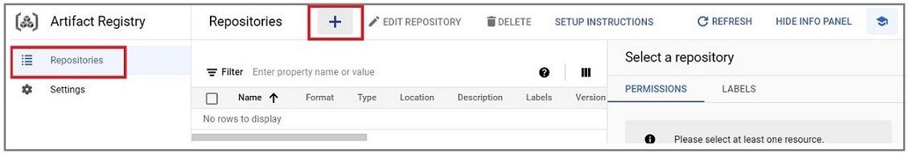
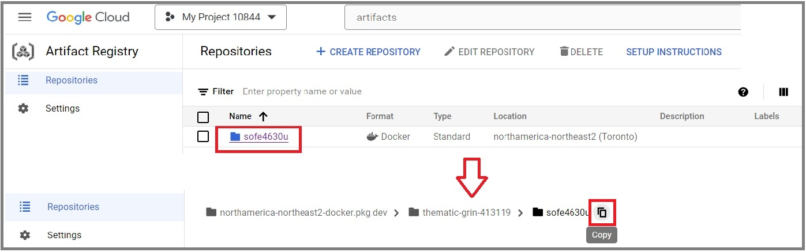

# Milestone 4: Google Pub/Sub communication for Microservices
## Objective:
* Get familiar with microservices.
* Implement microservice using Python.
* Containerize Python application.
* Configure Pub/Sub Subscription(s) to filter the receiving messages.

## Repository:
[https://github.com/GeorgeDaoud3/SOFE4630U-MS4](https://github.com/GeorgeDaoud3/SOFE4630U-MS4)

## Introduction 
1. See the following video for [the foundations of microservices](https://www.youtube.com/watch?v=lL_j7ilk7rc).
2. Read this document about [Event-driven architecture with Pub/Sub](https://cloud.google.com/solutions/event-driven-architecture-pubsub). Focus on the **event filter** technique, its advantages, limitations, and implementation. The microservices implemented in the milestone will use this technique to communicate.
3. The milestone would implement a cloud solution for a cloud-based election system. The following figure shows the architecture of the system

   
   
   It consists of:
   1. **A voting machine**
      * A Python script that will run on a local machine to simulate a real voting machine.]
      * First, it asks for the **election ID** and the **machine ID**.
      * Then, it generates random votes and sends them to a **voting logger** service.
      * Finally, it will wait for a response for 10 sec.
      * There will be three expected outputs: 
         1. **Already voted** if a vote with the same **voter ID** was processed before.
         2. **A vote was recorded successfully**.
         3. **Time out** if the vote processing takes much longer than expected (10 sec).
      * You can run multiple script instances but with different **machine ID**. 
   2. A **voting logger** service.
      * The service accesses a Redis server to store the IDs of the voters who have already been voted on.
      * When a vote is received,
         * Redis will be checked for the **voter ID**.
         * If the **voter ID** exists, an **Already voted** message will be sent to the voting machine.
         * Otherwise,
            * The **voter ID** will be stored in the Redis database to prevent the voter from repeating the vote.
            * After excluding the **voter ID** (for voter privacy policy), the voting information will be sent to the **voting record** service.
   3. A **voting record** service.
      * The service uses a **PostgreSQL** server to store the votes.
      * Once, a **voting record** is received, it will be stored in a the **PostgreSQL** server.
      * Then a **A vote was recorded successfully** will be sent to the **voting machine**.
   4. A **Google Pub/sub** for handling the communication between the microservices.
      * No IP or URL of the microservices is needed to exchange data. Only the **topic ID** is needed.
      * One topic will be used to exchange the data between the voting machine(s) and the two services.
      * The message attributes will be set to filter the messages. Subscriptions will be created for the topic. Each will specify the condition of the received message (filter). Only messages with a matched filter conditions will be received by the Subscriber using the filtered subscription.
      * The attribute values set and filtered by each microservice as well as the message formats are shown in the following figure.

        
## settng up the GCP project
1. Create a new topic in Google Pub/Sub with a default subscription; name it **election**.
2. Create a service account with the Google Pub/Sub admin rule. Create and download a JSON file with the corresponding credentials. ( **or use the one already created in MS2**)
3. As each service will be containerized, a docker repository is needed to host the docker images of the **logger** and **recorder** services.
   1. Search for Artifact Registry
      
      
   2. In the **repositories** tab, press the + button to create a new repo.
    
      
   3. Name it **sofe4630u** and make sure that the type is set to **Docker**. Set the region to **northamerica-northeast2 (Toronto)**. Finally, press **create**.

      
   4. open the **sofe4630u** repository and copy the repo path.

      

      and save it in an environment variable
      ``` cmd
      REPO=<REPO full path>
      echo $REPO
      ```
      Or you can search for the the full path using
      ``` cmd
      REPO=$(gcloud artifacts repositories list --location northamerica-northeast2 --format 'json' | grep sofe4630 | grep -Po '"name": "\K[^"]*')
      echo $REPO
      ```
## The logger service
### The python Code
This subsection will go through the Python script at [voting_logger/main.py](voting_logger/main.py). 
1. **lines 11: 12**: search for a JSON file in the current directory and use it for GCP credentials. It assumes that only a single JSON file exists in the current directory.
2. **lines 15: 18**: use the values of predefined environment variables to set the values of redis_host, project_id, subscription_id, and topic_name variables. To prevent having the values of the variables hard coded in the code.
   
   

3.**lines 20: 22**: define a **debug** variable and initialize it by **False**. However, it can be changed to **True** in the code or by setting another environment variable, **DEBUG**. If it is set to **True**, logs and information will be printed for debugging reasons, as in lines 23:28.
   
   

4. 

   
### Deployment of the service

     
